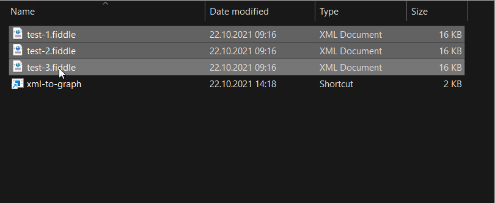
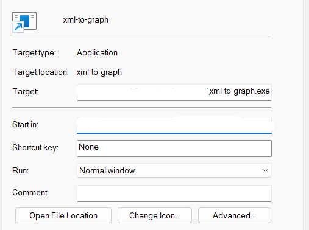

# xml-to-graph

Convertește reprezentările XML ale grafurilor generate cu ajutorul [acestei utilități](http://info.tm.edu.ro:8088/~ORosu/clasa/11b/graf.jar) în fișiere de intrare pentru problemele date la clasă, în stilul pbinfo.

Descarcă pentru [Windows](https://github.com/tmaxmax/xml-to-graph/releases/download/v0.2.1/xml-to-graph.exe) sau [Linux](https://github.com/tmaxmax/xml-to-graph/releases/download/v0.2.1/xml-to-graph) și apoi adaugă locația executabilului în PATH pentru a-l putea rula de oriunde.

## Utilizare

```sh
$ xml-to-graph path/to/file.xml path/to/another.xml
```

Dacă ai foarte multe fișiere, poți folosi un glob pattern:

```sh
$ xml-to-graph -glob graph-*.xml
```

Pe Windows, dă drag-and-drop la fișiere și vor fi convertite automat!



Locația de salvare implicită este cea în care este rulat `xml-to-graph`. Dacă îl rulezi utilizând un shortcut Windows, această locație este cea specificată în câmpul `Start in` din proprietățile shortcut-ului:



Rulează `xml-to-graph --help` pentru a vedea cum poți modifica locația de salvare, formatul fișierelor de ieșire și altele.
